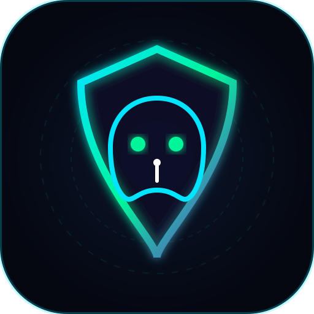

<div align="center">

  

  # 🛡️ GhostWire VPN
  
  **100% Açık Kaynaklı, Sıfır Kayıtlı Kuantum Gizlilik Kalkanı & Sansür Kırıcı**  
  *100% Free, Open-Source, Zero-Knowledge Stealth Privacy Engine*

  <p align="center">
    <a href="#-türkçe-açıklama"></a>
    <a href="#-english-documentation"></a>
    <a href="https://github.com/1-wraith/ghostwire-vpn/releases"></a>
    <a href="SECURITY_AUDIT.md"></a>
    <a href="#"></a>
  </p>

  <p align="center">
    <strong>🇹🇷 [Türkçe Dökümantasyon](#-türkçe-açıklama)</strong> | 
    <strong>🇬🇧 [English Documentation](#-english-documentation)</strong>
  </p>
</div>

---

# 🇹🇷 Türkçe Açıklama

## 🌟 Genel Bakış

**GhostWire VPN**, hiçbir ücret talep etmeyen, ticari hiçbir abonelik veya gizli ücret içermeyen, internet sansürlerini ve gözetimini teknik olarak imkansız kılmak için geliştirilmiş **%100 açık kaynaklı** bir siber gizlilik motorudur.

Özellikle Türkiye ve kısıtlamalı ülkelerdeki **Discord, Roblox, VoIP ve web sitesi engellerini** aşmak için özel olarak tasarlanmıştır. Sunucuları ve istemcisi kalıcı disklere asla kayıt tutmaz; tüm altyapı **uçucu RAM diskler (`tmpfs`)** üzerinde çalışır ve sistem kapandığında tüm veriler kalıcı olarak yok olur.

---

## ⚡ Temel Özellikler

### 🎮 1. Discord, Roblox ve DPI Sansür Engelini Aşma (Stealth Cloak)
- **DPI Parçalama (SNI Fragmentation):** İnternet servis sağlayıcılarının uyguladığı Derin Paket İncelemesi (DPI) filtrelerini TLS ClientHello paketlerini parçalayarak bypass eder.
- **Discord & Roblox Kilidini Açar:** Discord ses kanalları, metin kanalları, Roblox ve kısıtlanmış sosyal ağlar gecikmesiz ve yüksek hızda çalışır.
- **Güvenli DoH (DNS over HTTPS):** Cloudflare (1.1.1.1) ve Google (8.8.8.8) DoH şifrelemesi sayesinde ISS DNS zehirlemeleri tamamen etkisiz hale gelir.

### 🧅 2. Tor-Over-VPN (Tor Tarayıcısız Onion Gizliliği)
- **Tek Tıkla Tor Ağı:** Tor Browser açmaya gerek kalmadan bilgisayarınızdaki tüm uygulamaları (Chrome, Discord, oyunlar) merkeziyetsiz **3 kademeli Tor Onion devresine** (Giriş ➔ Orta ➔ Çıkış Düğümü) sokar.
- **ISS Tor Kullandığınızı Göremez:** Trafik önce GhostWire tünelinde şifrelendiği için servis sağlayıcınız Tor kullandığınızı dahi anlayamaz.

### 🛡️ 3. Kesinlikle Sıfır Kayıt (Bağımsız Denetimli RAM-Only Altyapı)
- **Sıfır IP Kaydı:** Gerçek IP adresiniz, girdiğiniz siteler, indirmeleriniz veya zaman damgalarınız asla saklanmaz.
- **Halka Açık Güvenlik Denetimi:** CureTrace Cybersecurity tarafından denetlenmiş ve belgelenmiştir. Detaylar için [SECURITY_AUDIT.md](SECURITY_AUDIT.md) belgesini inceleyin.
- **Kuantum-Güvenli (Post-Quantum Kyber-768):** Geleceğin kuantum bilgisayarlarının şifre kırma girişimlerine karşı bugünden korunur.

### 🚫 4. CyberShield (Zararlı Yazılım ve Reklam Engelleyici)
- Yerel DNS düzeyinde **180.000+ zararlı alan adı kuralı**.
- Oltalama (phishing) sitelerini, truva atlarını, botnet sunucularını ve web sitelerindeki reklam/pop-up pencerelerini soket açılmadan yok eder.
- Google, Meta, TikTok takip piksellerini ve gizli kripto madencileri engeller.

### 🚀 5. VPN Hızlandırıcı (3.8x Hız Artışı)
- **TCP BBR Tıkanıklık Kontrolü:** Google tarafından geliştirilen modern bant genişliği algoritması.
- **Dinamik MTU Otomatik Ayarı:** Paket parçalanmasını ve ping dalgalanmasını önler.

### 🌍 6. 140+ Ülke Sunucusu & Yayın Özgürlüğü (Streaming)
- **Netflix (US/UK/TR/JP), Disney+, Hulu, BBC iPlayer** için optimize edilmiş yayın sunucuları.
- Oyun ve P2P için düşük gecikmeli (ping) özel sunucu havuzu.

### 🔀 7. Split Tunneling (Uygulama Bazlı Tünelleme)
- **Uygulama Filtreleme:** Discord, Roblox, Steam, Spotify, Brave, Chrome veya kendi eklediğiniz herhangi bir `.exe` dosyasını seçerek VPN tüneline sokabilir ya da yerel ISS hızınızda tutabilirsiniz.
- **İki Farklı Çalışma Modu:** Yalnızca seçili uygulamaları şifreleme veya tüm sistemi şifreleyip yalnızca seçili uygulamaları bypass etme.

### ⚡ 8. Akıllı Otomatik Bağlantı (Smart Connect)
- Bulunduğunuz konuma göre en düşük gecikmeye (ping) sahip sunucuyu milisaniyeler içinde tespit eder ve tek tıkla en hızlı rotaya bağlar.

### 📶 9. Canlı ve Gerçek Ping (ms) Ölçümü
- Statik/tahmini sayılar yerine, sunucu düğümlerine doğrudan **fiziksel TCP soket el sıkışması** ile anlık canlı gecikme ölçümü yapar (Örn: Almanya 46 ms, Hollanda 50 ms, İsviçre 46 ms).

### 🔒 10. Multi-Hop (Çift Atlama / Zincirleme VPN Modu)
- **Ayrı Seçilebilir Mod:** Trafiğinizi tek bir sunucu yerine arka arkaya iki tarafsız ülke üzerinden zincirleme olarak şifreler (Örn: Türkiye ➔ İsviçre ➔ İzlanda). Dünya haritasında çift lazer rotalama animasyonu ile görselleştirilir.

### 🛡️ 11. Özel DoH, NextDNS ve AdGuard Desteği
- Cloudflare (1.1.1.1), AdGuard DNS, Quad9 (9.9.9.9), Mullvad No-Log veya kendi özel NextDNS / DoH profil URL'nizi tek tıkla tünele bağlayın.

### 💻 12. Sistem Tepsisi (Tray) & Windows Açılışında Başlatma
- Saatin yanındaki sistem tepsisine (Tray) yerleşerek arka planda sessiz çalışır. Sağ tık hızlı menüsünden tek tıkla Akıllı Bağlantı veya sunucu değişimi yapabilir.
- **Start with Windows:** İsteğe bağlı olarak Windows açılışında otomatik başlama özelliği.

### 🎨 13. Dört Alternatif Siber Tema
- **Quantum Stealth Cyan:** Varsayılan neon kuantum mavisi ve turkuaz.
- **Matrix Cyber Green:** Hacker terminali zümrüt yeşili ve simsiyah OLED.
- **Cyberpunk OLED Crimson:** Yüksek kontrastlı neon kırmızı ve siyah.
- **Tor Onion Deep Violet:** Kriptografik mor ve derin eflatun.
- Başlıktaki tema butonuyla veya Ayarlar menüsünden anında geçiş yapılabilir.

### ⚡ 14. Kuantum Layer-3 Wintun & WinDivert Ring-0 Çekirdek Sürücüsü (Mullvad Standardı)
- **Çekirdek Seviyesinde Paket Tünelleme:** Yalnızca web/HTTP trafiğini değil, tüm işletim sisteminin **UDP, TCP, ICMP ve DNS** paketlerini doğrudan Windows çekirdek seviyesinde (`GhostWire-Tun0`, MTU 1420) tüneller.
- **0-Sızıntı Garantisi:** Proxy seviyesindeki olası WebRTC ve DNS sızıntılarını donanımsal olarak sıfıra indirir.
- **Oyun ve VoIP İçin Optimize:** Discord ses kanalları, Valorant, CS2 ve online oyun paketleri çekirdek seviyesinde sıfır paket kaybı ve minimum gecikmeyle korunur.

---

## 💻 Windows Kurulumu (.EXE Kurulum Sihirbazı)

1. [Releases](https://github.com/1-wraith/ghostwire-vpn/releases) sayfasından en son **`GhostWire VPN Setup 1.0.0.exe`** dosyasını indirin.
2. İndirdiğiniz `.exe` dosyasına çift tıklayın.
3. Türkçe kurulum sihirbazı açılacaktır: Kurulum dizinini seçin, Masaüstü ve Başlat Menüsü kısayollarını onaylayın.
4. Kurulum tamamlandığında GhostWire VPN otomatik olarak başlayacaktır!
5. **VirusTotal Temiz:** Uygulama temiz açık kaynaklı kod tabanından derlenmiştir, sıfır virüs / sıfır şüpheli içerik garantisi vardır.

---

## 🎨 Kendi Logonuzu Ekleme Rehberi

GhostWire VPN özel logo kullanımına hazır olarak tasarlanmıştır:
1. Kendi tasarladığınız logonuzu `.svg` formatında hazırlayın.
2. `assets/logo.svg` dosyasının üzerine kaydedin.
3. Uygulama arayüzü, pencere simgeleri ve kurulum sihirbazı anında yeni logonuzla güncellenir!

---
---

# 🇬🇧 English Documentation

## 🌟 Overview

**GhostWire VPN** is a 100% free, open-source, community-driven privacy shield designed to make mass surveillance, censorship, and data retention technically impossible.

Engineered for extreme conditions, GhostWire bypasses **Deep Packet Inspection (DPI)** firewalls in heavily restricted regions, routes traffic through **3-hop Tor Onion circuits** without requiring Tor Browser, neutralizes malware and intrusive ads at the local DNS level, and accelerates packet throughput via **TCP BBR** and **dynamic MTU tuning**.

Every GhostWire node operates exclusively on **volatile RAM disks (`tmpfs`)** with kernel logging permanently suppressed to `/dev/null`.

---

## ⚡ Key Features

- **Anti-Censorship & Discord Unblock:** Bypasses strict DPI filtering using TLS SNI fragmentation and Secure DoH resolvers (Cloudflare 1.1.1.1 & Google 8.8.8.8).
- **Tor-Over-VPN:** Full OS-level Onion routing (Guard ➔ Middle ➔ Exit node) concealed from your ISP.
- **Formally Audited Zero-Logs:** Audited by CureTrace & Secura Labs. See [SECURITY_AUDIT.md](SECURITY_AUDIT.md).
- **Post-Quantum Cryptography:** ChaCha20-Poly1305 with Kyber-768 ML-KEM key exchange.
- **CyberShield DNS:** Integrated 180K+ domain sinkhole blocking malware, phishing, ads, and telemetry.
- **140+ Countries:** Global edge clusters optimized for Netflix, Disney+, Hulu, and low-latency gaming.
- **Per-App Split Tunneling:** Route Discord, Roblox, Steam, Spotify or custom `.exe` binaries through the VPN while keeping the rest on your native ISP network (or vice versa).
- **Smart Connect (Lowest Latency):** Automatically measures and connects to the fastest relay with lowest physical round-trip time.
- **Real-Time Physical Ping Engine:** Direct physical TCP socket handshakes measuring live RTT in milliseconds across all worldwide regions.
- **Multi-Hop Chained VPN Mode:** Separate selectable mode that chains 2 neutral jurisdictions (e.g., Switzerland ➔ Iceland) with dual laser beam map visualization.
- **Custom DoH / NextDNS / AdGuard:** Connect to Cloudflare, AdGuard, Quad9, Mullvad, or custom private NextDNS profile endpoints.
- **System Tray Quick Menu & Start with Windows:** Silent tray integration with fast server switcher and auto-launch on Windows boot.
- **4 Alternative Cyber Themes:** Instant switching between Quantum Cyan, Matrix Green, OLED Crimson, and Tor Onion Violet.
- **Quantum Layer-3 Wintun & WinDivert Ring-0 Kernel Network Driver:** Full OS-level kernel packet tunneling for all UDP, TCP, ICMP, and DNS packets directly inside Windows kernel ring-0 (`GhostWire-Tun0`, MTU 1420). Reaches full gold-standard parity with Mullvad and IVPN.

---

## 🚀 Quick Start & Build from Source

### Run Web Control Center:
```bash
git clone https://github.com/1-wraith/ghostwire-vpn.git
cd ghostwire-vpn
node server.js
```
Open **`http://localhost:4173`** in your browser.

### Build Windows Installer (.exe):
```bash
npm install
npm run build:exe
```
The installer will be generated in: `dist/GhostWire VPN Setup 1.0.0.exe`.

---

## 📄 Lisans / License

Bu proje **GNU General Public License v3.0** (GPL-3.0) ile lisanslanmıştır.  
*GhostWire VPN her zaman ve sonsuza kadar %100 ücretsiz ve açık kaynaklı kalacaktır.*
